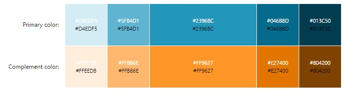
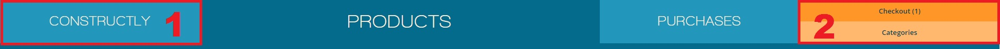
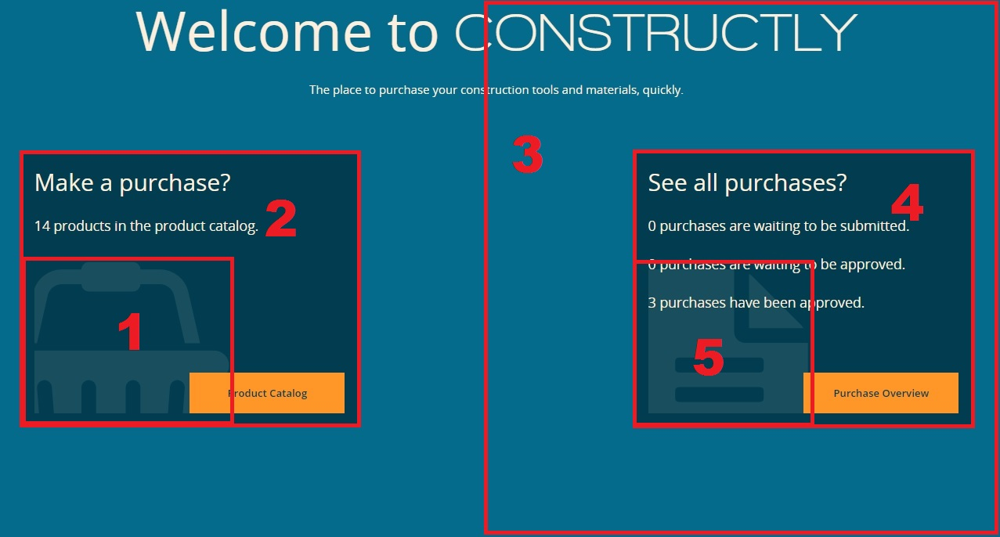
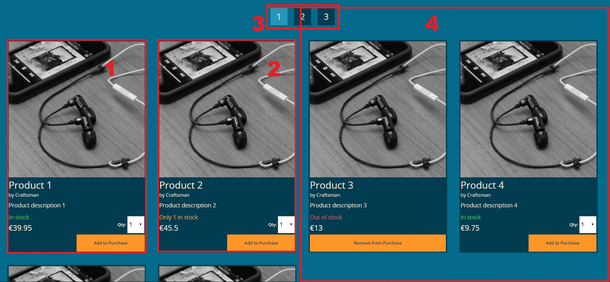
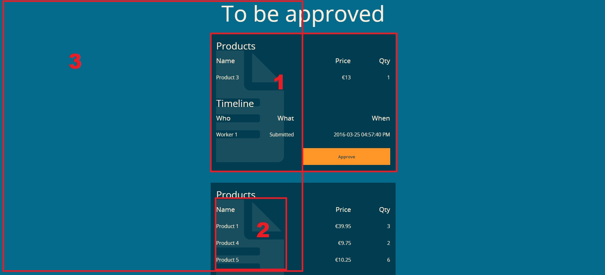

<link rel="stylesheet" href="/styles/handover.css">

# Mandatory Assignment in Front-end Development
This document is part of the mandatory assignment in the course Front-end Development held in Spring 2016 at BAAA - Business Academy Aarhus. 

## Project description
Develop a prototype of a website for construction workers and reflect upon the design
decisions made. The prototype shall work on both mobile phones, tablets and
desktop computers. The construction worker should be able to purchase from the mobile phone or
tablet and rapidly find products while working in the field. The target user for the desktop version is
administration people in an office who needs to verify and approve purchases.

### Functional requirements
The website shall contain the following pages and features:
The site must be responsive and must include: 
* Front page.
* Product catalogue with a gallery/list of minimum 32 products. The product page can hold 16
products, so there has to be at least two pages with products.
* Purchase history that lists earlier purchases.
* Scanning function (on the mobile version) of barcodes or products serial numbers which allow
for quick purchase and delivery. You may fake this feature through the camera on the mobile phone,
or you may try out libraries that supports this functionality.

## General considerations
As the construction workers will be using the website while working in the field and mainly when missing tools or building material, the website should accommodate their needs in a fast, simple and intuitive way, so they the can get back to the work that really matters as quickly as possible. Their three main goals of using the website will be to easily find the needed products, place purchases and to quickly get an overview of already placed purchases, which haven't yet been approved. 

For the administration people in the office it should be easy to get an overview of yet to be approved purchases, approve these purchases and to see the purchase history for accounting purposes.

Taking both the construction workers and the administration people into account the audience is rather wide-aged, properly aged from around 16 to 60 years of age, and the construction workers will primarily be males. Besides the wide-aged audience we also have some cultural variety with the construction workers on one side and the administration people on the other side. The field workers shouldn’t be thinking the website is clearly made for the administration people back in the office and vice versa. 

As the users are going to access the website using both smartphones, tablets and desktop computers the website will need to be responsive adjusting the content based on the available screen dimensions. This is done using the aforementioned fluid grid system along with flexible images and media queries in a mobile-first approach.

Both the design and the technical implementation will try to address these considerations.

## Design part
Consider the following:
 * Form Follows Function (Never sacrifice your message for your design. Focus on readability, narrative, and information. Use your design to reinforce your message, never the other way around.
 
Based on the target audience and the primary use of the site, the goal of the design will be to have a simple and intuitive navigation, which enables the user to be productive and quickly find the needed tools or materials. The goal of the design should not be to draw the user in and keep him/her on the site, as both the construction workers and administration people main tasks using the website should not take very long time. 

The design should also support that the construction workers often will be outdoors when using the website - sometimes maybe in under bad weather conditions and while having cold, dirty or wet fingers and of course using mobile devices with smaller screen sizes. 

As for the wide-age audience and cultural variety the design style cannot be too fancy but should instead support the functional goals of the website to be productive and enabling completion of the task at hand as quickly as possible. The design will not be addressing these challenges by having different designs for construction workers and administration people, but will be a consistent across users and devices. However, this will put some constraints on the design possibilities. 

The design should send the message that this a trustworthy and reliable website that will solve the users needs. The language should be simple, clear and in an informative tone. 

### Style guide
The style guide described in this section will be a guidance and a set of rules for a consistent design on the webpage. To address the mentioned design goals and considerations from last section the choice of design will be flat and simple and thereby quick to grasp by the user. It will not be over-styled in order to better appeal to the wide audience.

#### Typeface
The website uses the Open Sans typeface - a humanist sans-serif typeface - as it's well suited for the flat design supporting the design target and it works well on both web and mobile. It makes the content easily readable even in small sizes, which will be very beneficial for the construction workers on their smaller screen sizes.

Besides the Open Sans typeface the geometric Walkway typeface will also be used both when naming the title of the site - as a simple logo - and in the navigation using capital letters to create contrast and catch attention applying the principle of decisive contrast. The geometric font type also fits in the overall construction-site setting.

The body font size is 1.4 rem with an appropriate line-height, which will enhance readability on all devices.

??? Add body + lorem text + css selector

As the hierarchical structure of the site is not that deep only a few different headings are needed. The focus here is to create a typographical scale which enables the user to easily visualize the hierarchical structure and to let the headings stand out compared to the body text.

??? Add h1, h2, small/byline + css selectors

#### Navigation
The font size on navigation elements is ???rem to draw more attention than the body text, but still not taking focus away from the largest headlines. The font-size on the active navigation link will be slightly larger in order to catch attention and create a sense of depth. As mentioned before the Walkway typeface will be used in the navigation - again to catch attention and to stand out.

??? Add .navigation + css selector

#### Colors
This section will discuss the choice of the overall color scheme for the site along with the typeface colors. The color scheme will be applied in later sections presenting buttons, widgets, navigation and other components

Color schemes for flat designs are often brighter and more colorful than those for other sites. Even though flat designs often use several different colors, this site goes for a more simple and minimalistic approach by using a monochromatic color scheme supporting the rather limited content. The base color will be blue as it signals security, truth, stability, loyalty and open communication, which assists the overall goal of the site. 

To offset the primary cold blue monochromatic colors a complementary brown color is added to the final color scheme to help create more depth in the site and will be used to catch the users attention on call-to-action elements by standing out with the blue background colors. The brown color signals durability and stability, which - as the blue color - is well suited for this site. The color scheme can be found in figure \ref{color-scheme}.

The background color of the site will be using the primarily blue color, where black or gray typeface colors can be quite hard to read. Instead a very light complementary brown color (almost white) will be used as the default typeface color, thereby increasing the contrast between the background color and the typeface color..

??? Examples

On call-to-action elements using a brown background color a dark blue typeface will be used - again to increase the contrast. 

#### Buttons
The site used a limited amount of different buttons to keep the design simple and consistent across the different pages.  

The buttons will most often be placed on a blue background, so using the warmer brown color will increase the sense of depth putting the button in focus.

The default buttons will have a darker tone of brown in all its states compared to the utility buttons (Login and Categories buttons) to enhance separation of default and utility buttons in the navigation bar. On hover the background color will be darken (compared to its initial background color) to make the button pop-out and when pushed the button will be lighten (compared to its initial background color) to give a pushed down effect.

Furthermore, buttons can also have a disabled state - e.g. the Checkout button when no products have been added - which are visualized by a gray background color with no states or changing cursor on hover.

The buttons used for pagination will have a lighter blue background color when active to signify that the button is in the background and has been pushed-down in comparison to inactive pagination buttons, which have a darker blue background color to signify that these buttons are inactive and can be pushed down/activated. The hover effect on inactive pagination buttons has a lighter blue background color telling the user what to expect if the button is pressed.

??? Examples on default, utility, disabled and pagination (+ hover states)

#### Widgets, Products and Purchases
The widgets on the front-page along with the products and purchases on the two other pages all follows the same design. Having a darker blue background makes these elements stand out and create a sense of depth the call-to-action button in the bottom right corner function as an naturally-placed action on each element. 

For the products a classic three-way traffic-light combination is used to signal the availability of the product - a red color typeface are used for products out of stock, yellow when only few are in stock and green when the are plenty items left in stock.

??? Example on 

#### Navigation
The navigation uses a tab-approach thereby connecting the navigation bar with the content. To signify the active navigation tab a larger font-size is used in combination with an increased tab width (this feature is not available on vertical held mobiles due to screen width limitations). The brand-logo is used as the first tab naturally integrating the logo with the navigation bar. This helps creating a consistent experience across devices as the navigation become light on content - going from mobile to tablet (or even desktop) only slightly changes the navigation composition.

Due to a small screen width on vertical held mobiles the navigation-utility elements are put above the navigation tabs. As there are four utility elements (Scan, Login, Categories and Checkout) compared with only three navigation tabs, the Categories utility button is only visible on the Product page replacing the Login utility button. This can be done as the Categories button only makes sense on the Product page and the Login button is not necessary until the purchase needs to be submitted or approved on the Purchases page.

The navigation bar is fixed to the top of the screen, so the user always have a sense of where they are and can always navigate between pages even when deep down a page. This is especially helpful for the construction workers when they have added the final product to their purchase and quickly want to checkout. Furthermore, a small part of the content background is reserved for the fixed positioned navigation preventing the content to scroll up "into" the navigation bar. 

?? Example on both mobile vertical and "default"
 
#### Grid system
The site is using a 12-column grid system with a 2% gutter and the following set of break points

* Max-width 479px for mobile
* Min-width 480px for mobile (horizontal view)
* Min-width 768px for tablet
* Min-width 992px for laptop
* Min-width 1200px for desktop

The min-width 480px break point is added to have better control over the design when using the mobile in a horizontal view. The extra width compared to a mobile in a vertical view has a rather significant impact on the design - especially in relation to the range of valid font-sizes, the number of grid columns the different components span and the navigation. 

### Using Gestalt Principles
The following subsections will discuss how the Gestalt Principles have been applied to the different parts of the site  

#### Navigation

Figure \ref{gestalt-navigation} has been marked two points of interest
1. Similarity: The inactive navigation tabs look similar and will be perceived as similar.
2. Proximity: The utility buttons follows both the similarity and and the proximity principles and as the navigation tabs perceived as similar.

#### Front page 

Figure \ref{gestalt-front-page} has been marked five points of interest
1. Closure: The icons used in the widgets are cut off put due to the closure principle we can still visualize the full icon.
2. Figure and ground: The widgets (figures) are stading out because of the darker background compared to the lighter page background (ground).
3. Symmetry: The page is symmetric which creates a pleasant balance.
4. Similarity: The widgets follows the same design template making them recognizable. 
5. Cross-site similarity: The purchase icon is also used on the Purchase page on the purchase components linking the them together.

#### Product page

Figure \ref{gestalt-product-page} has been marked four points of interest
1. Figure and ground: As for the widgets, each product stands out by having a different  background color than the background color of the page.
2. Similarity: The product share the same design template.
3. Proximity: The pagination buttons are both similar and in close proximity to each other, so we likely perceive them as one group.
4. Symmetry: The product page is symmetric. 

#### Purchase page

Figure \ref{gestalt-purchase-page} has been marked five points of interest
1. Similarity: The purchase elements follows the same pattern as the widgets and products by following a design template.
2. Cross-site similarity: The purchase icon is shared between the purchase elements and the purchase widget on the front page.
3. Symmetry: The purchase page is symmetric. 

 
## Technical part
The site is using a Node.js with Express to easily setup and have a web server running. Using CSS frameworks or any MV* JavaScript framework has not been allowed. Instead the web server is using node-sass-middleware, which automatically compiles Sass files. Furthermore, Express Handlebars is used, which is a Handlebars view engine for Express that is circumventing a lot of repetition in the mark-up source files.

The web server is not connected to any database, but is using two services that serve the product catalog and a few pre-made purchases, so the Purchase page is not completely empty. These two services also handle state changes when adding purchases, but be aware that restarting the web server will also reset these services to their initial state. 

The barcode scanner is implemented by picking a random product from the product catalog and applying the picture from the Camera API.

To have a more fluent user experience every interaction on the site triggers a post request to the web server updating the current state on the server. Client-side JavaScript is afterwards updating the UI instantly mitigating re-rendering of the whole page after every interaction.    

The product catalog pagination on the Product page is solved using url's with query strings containing the page number. The pressing the pagination buttons triggers a get request containing the page number which is processed by the web server which then responds by serving a page with products corresponding to the requested page.  

### Build process
Be aware that updating font-awesome might prevent the web server from running as the necessary css and font files are not copied to the ./public/vendor folder. The "main" property in .bower.json file should look like the following to insure the css and font files are copied correctly to the ./public/vendor/ folder

'''javascript
  "main": [
    "css/font-awesome.css",
    "fonts/*.*"
  ],
'''

## Further development
* Add purchase states: reject submitted bids. 
* Edit submitted purchases
* Clear all added products
* Close button in top right corner on modal windows
* User authentication and authorization